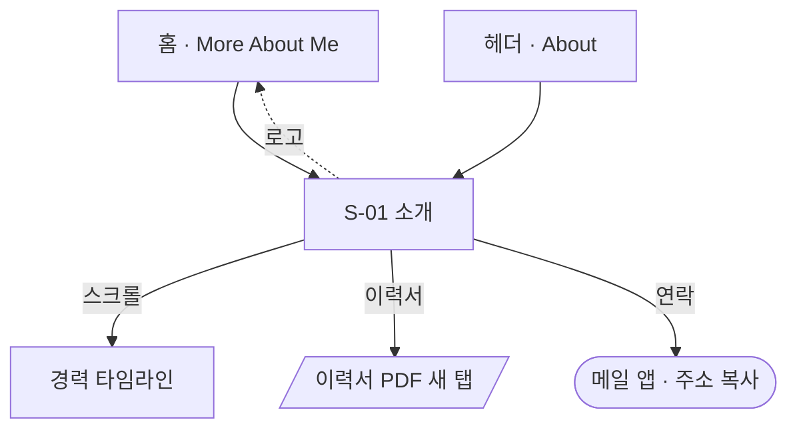

# 소개 — 유저 플로우

[README.md](./README.md) 의 정책을 기준으로 방문자 동작을 흐름으로 옮겼다. 초안이라 모든 흐름이 `제안` 이다.

## 1. 전체 흐름

```mermaid
flowchart TD
    HOME["홈 · More About Me"]:::step --> A["S-01 소개"]:::screen
    NAV["헤더 · About"]:::step --> A
    A -->|"스크롤"| TL["경력 타임라인"]:::step
    A -->|"이력서"| PDF[/"이력서 PDF 새 탭"/]:::api
    A -->|"연락"| C(["메일 앱 · 주소 복사"]):::done
    A -.->|"로고"| HOME
```

- 연락의 흐름은 홈과 같다.([home/userflow.md](../home/userflow.md) 4절)
