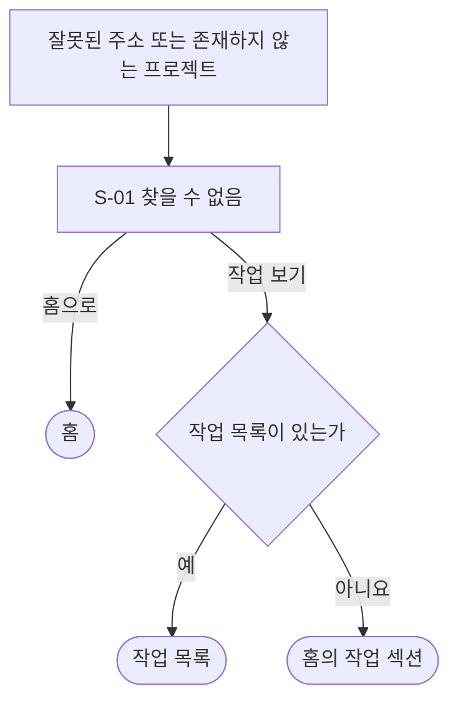

# 찾을 수 없음 — 유저 플로우

[README.md](./README.md) 의 정책을 기준으로 방문자가 페이지를 찾지 못했을 때의 이동 흐름을 제안한다.

## 1. 전체 흐름

```mermaid
flowchart TD
    BAD["잘못된 주소 또는 존재하지 않는 프로젝트"]:::warn --> NF["S-01 찾을 수 없음"]:::screen
    NF -->|"홈으로"| HOME(["홈"]):::done
    NF -->|"작업 보기"| WORK{"작업 목록이 있는가"}:::decision
    WORK -->|"예"| WL(["작업 목록"]):::done
    WORK -->|"아니요"| HP(["홈의 작업 섹션"]):::done
```
